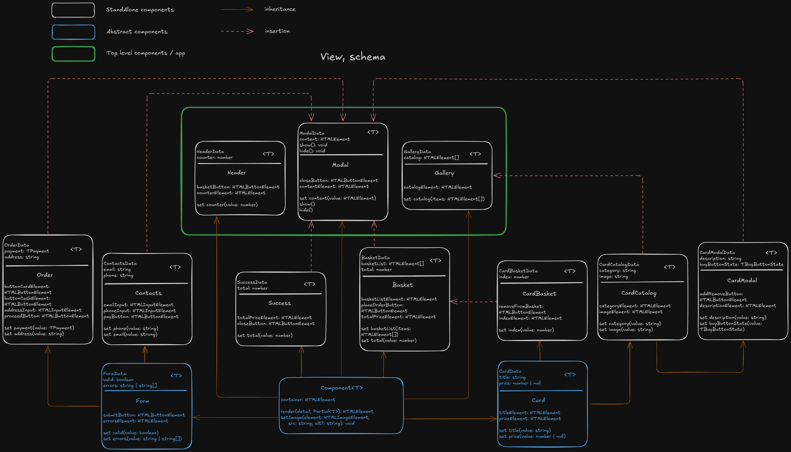

# Проектная работа "Веб-ларек"

Стек: HTML, SCSS, TS, Vite

Структура проекта:
- src/ — исходные файлы проекта
- src/components/ — папка с JS компонентами
- src/components/base/ — папка с базовым кодом

Важные файлы:
- index.html — HTML-файл главной страницы
- src/types/index.ts — файл с типами
- src/main.ts — точка входа приложения
- src/scss/styles.scss — корневой файл стилей
- src/utils/constants.ts — файл с константами
- src/utils/utils.ts — файл с утилитами

## Установка и запуск
Для установки и запуска проекта необходимо выполнить команды

```
npm install
npm run dev
```

## Сборка

```
npm run build
```

# Интернет-магазин «Web-Larёk»
«Web-Larёk» — это интернет-магазин с товарами для веб-разработчиков, где пользователи могут просматривать товары, добавлять их в корзину и оформлять заказы. Сайт предоставляет удобный интерфейс с модальными окнами для просмотра деталей товаров, управления корзиной и выбора способа оплаты, обеспечивая полный цикл покупки с отправкой заказов на сервер.

## Архитектура приложения

Код приложения разделен на слои согласно парадигме MVP (Model-View-Presenter), которая обеспечивает четкое разделение ответственности между классами слоев Model и View. Каждый слой несет свой смысл и ответственность:

Model - слой данных, отвечает за хранение и изменение данных.  
View - слой представления, отвечает за отображение данных на странице.  
Presenter - презентер содержит основную логику приложения и  отвечает за связь представления и данных.

Взаимодействие между классами обеспечивается использованием событийно-ориентированного подхода. Модели и Представления генерируют события при изменении данных или взаимодействии пользователя с приложением, а Презентер обрабатывает эти события используя методы как Моделей, так и Представлений.

### Базовый код

#### Класс Component
Является базовым классом для всех компонентов интерфейса.
Класс является дженериком и принимает в переменной `T` тип данных, которые могут быть переданы в метод `render` для отображения.

Конструктор:  
`constructor(container: HTMLElement)` - принимает ссылку на DOM элемент за отображение, которого он отвечает.

Поля класса:  
`container: HTMLElement` - поле для хранения корневого DOM элемента компонента.

Методы класса:  
`render(data?: Partial<T>): HTMLElement` - Главный метод класса. Он принимает данные, которые необходимо отобразить в интерфейсе, записывает эти данные в поля класса и возвращает ссылку на DOM-элемент. Предполагается, что в классах, которые будут наследоваться от `Component` будут реализованы сеттеры для полей с данными, которые будут вызываться в момент вызова `render` и записывать данные в необходимые DOM элементы.  
`setImage(element: HTMLImageElement, src: string, alt?: string): void` - утилитарный метод для модификации DOM-элементов ``


#### Класс Api
Содержит в себе базовую логику отправки запросов.

Конструктор:  
`constructor(baseUrl: string, options: RequestInit = {})` - В конструктор передается базовый адрес сервера и опциональный объект с заголовками запросов.

Поля класса:  
`baseUrl: string` - базовый адрес сервера  
`options: RequestInit` - объект с заголовками, которые будут использованы для запросов.

Методы:  
`get(uri: string): Promise<object>` - выполняет GET запрос на переданный в параметрах ендпоинт и возвращает промис с объектом, которым ответил сервер  
`post(uri: string, data: object, method: ApiPostMethods = 'POST'): Promise<object>` - принимает объект с данными, которые будут переданы в JSON в теле запроса, и отправляет эти данные на ендпоинт переданный как параметр при вызове метода. По умолчанию выполняется `POST` запрос, но метод запроса может быть переопределен заданием третьего параметра при вызове.  
`handleResponse(response: Response): Promise<object>` - защищенный метод проверяющий ответ сервера на корректность и возвращающий объект с данными полученный от сервера или отклоненный промис, в случае некорректных данных.

#### Класс EventEmitter
Брокер событий реализует паттерн "Наблюдатель", позволяющий отправлять события и подписываться на события, происходящие в системе. Класс используется для связи слоя данных и представления.

Конструктор класса не принимает параметров.

Поля класса:  
`_events: Map<string | RegExp, Set<Function>>)` -  хранит коллекцию подписок на события. Ключи коллекции - названия событий или регулярное выражение, значения - коллекция функций обработчиков, которые будут вызваны при срабатывании события.

Методы класса:  
`on<T extends object>(event: EventName, callback: (data: T) => void): void` - подписка на событие, принимает название события и функцию обработчик.  
`emit<T extends object>(event: string, data?: T): void` - инициализация события. При вызове события в метод передается название события и объект с данными, который будет использован как аргумент для вызова обработчика.  
`trigger<T extends object>(event: string, context?: Partial<T>): (data: T) => void` - возвращает функцию, при вызове которой инициализируется требуемое в параметрах событие с передачей в него данных из второго параметра.


### Данные

#### Интерфейс товара - IProduct
```
interface IProduct {
  id: string;
  description: string;
  image: string;
  title: string;
  category: string;
  price: number | null;
}
```

#### Интерфейс покупателя IBuyer
```
interface IBuyer {
  payment: TPayment;    // 'card' | 'cash' | ''
  email: string;
  phone: string;
  address: string;
}
```


### Модели данных

#### Класс Products
Осуществляет управление списком товаров.

Конструктор:  
`constructor(productList: IProduct[] = [], selectedProduct?: IProduct)` - В конструктор опционально передается массив элементов типа IProduct, и, так же опционально, одиночный элемент типа IProduct. При вызове конструктора без аргументов, в поле productList будет установленн пустой массив, а поле selectedProduct останется undefined.

Поля класса:  
`private productList: IProduct[]` - массив всех товаров;  
`selectedProduct?: IProduct` - товар, выбранный для подробного отображения.

Методы:  
`setProducts(products: IProduct[]): void` - устанавливает в поле productList массив товаров, переданный в параметрах метода;  
`getProducts(): IProduct[]` - возвращает копию массива товаров;  
`getProduct(id: string): IProduct | undefined` - возвращает один товар из массива по его id, если товара с указанными id не окажется в массиве товаров - вернет undefined;  
`setSelectedProduct(product: IProduct): void` - устанавливает переданный в параметрах товар в поле selectedProduct, данный товар становится "выбранным" для подробного отображения;  
`getSelectedProduct` - возвращает "выбранный" товар, установленный в поле selectedProduct, или undefined, если это поле undefined.

#### Корзина - класс Cart
Осуществляет управление корзиной покупок.

Конструктор:  
`constructor(cart: IProduct[] = [])` - В конструктор опционально передается массив элементов типа IProduct. При вызове конструктора без аргументов, в поле cart будет установленн пустой массив.

Поля класса:  
`private cart: IProduct[]` - массив товаров в корзине.

Методы:  
`getCart(): IProduct[]` - возвращает копию массиа товаров корзины;  
`addToCart(product: IProduct): void` - добавляет переданный в параметрах товар в корзину;  
`removeFromCart(product: IProduct): void` - удаляет переданный в параметрах товар из корзины, если таковой там был;  
`clearCart(): void` - отчищает корзину, в поле cart устанавливается пустой массив;  
`totalCart(): number` - возвращает суммарную стоимость, находящихся в корзине товаров;  
`sizeCart(): number` - возвращает количество позиций в корзине;  
`isInCart(id: string): boolean` - проверяет наличие в корзине товара, по переанному в параметре id. Возвращает true если товар найдем в корзине и false в противном случае.

#### Покупатель - класс Buyer
Осуществляет управление данными покупателя.

Конструктор класса не принимает параметров.

Поля класса:  
`payment: TPayment = ''` - поле для указания вида оплаты, можеты быть либо пустым либо принять одно из значений: 'card' или 'cash';  
`email: string = ''` - поле для указания имейла;  
`phone: string = ''` - поле для указания телефона;  
`address: string = ''` - поле для указания адреса.

Методы:  
`setBuyer(buyerUpdates: Partial<IBuyer>): void` - принимает в параметрах обьект Partial<IBuyer> и устанавливает имеющиеся в нем поля в одноименные поля модели. Отсутствующие в передаваемом обьекте поля, сохраняют текущее значение;  
`getBuyer(): IBuyer` - возвращает содержание полей модели в виде объекта с одноименными ключами;  
`resetBuyer(): void` - сбрасывает поля модели, устанавливая в каждое из них пустую строку;  
`validateBuyer(): IValidateBuyer` - возвращает обьект с полями текстового типа, ключи которого соответствуют полям модели, а значения устанавливаются в '' (валидно) если одноименное поле модели не пустое, и в '<текст ошибки>' в противном случае. Также добавляется одно дополнительное булево поле buyer, получающее в качестве своего значения true только в том случае, когда все остальные поля обьекта '' (валидны), и false в противном случае.


### Слой коммуникации

#### Продуктовый АПИ - класс ProductsAPI
Реализует концепцию слабой связи между классами (инверсия зависимости). Хранит реализацию АПИ, осуществляющую логику запросов в соответствии с интерфейсом:
```
export interface IApi {
    get<T extends object>(uri: string): Promise<T>;
    post<T extends object>(uri: string, data: object,
        method?: ApiPostMethods): Promise<T>;
}
```

Конструктор:  
`constructor(api: IApi, readonly cdnURL: string)` - В конструктор передается обьект, соответствующий интерфейсу IApi, в нашем случае это будет экземпляр класса Api. Также в конструктор передается константа cdnURL с эндпоинтом по которому мы будем обращяться за изображениями.

Поля класса:  
`private readonly api: IApi` - поле для установки объекта, реализующего интерфейс IApi.

Методы:  
`getProducts(): Promise<IProduct[]>` - выполняет GET запрос на ендпоинт /product/ и возвращает промис со списком объектов IProduct, выделеным из ответа сервера по ключу 'items'. Также производит манипуляцию по изменинию поля image: собирает данное поле из cdnURL + имя файла (полученное от сервера в оригинальном поле image) + замена расширения с '.svg' на '.png';  
`postOrder(data: IOrder): Promise<IResponseOrder>` - принимает объект с данными типа IOrder, который будут передан в JSON в теле запроса, и отправляет эти данные POST запросом на ендпоинт /orden/. Возвращает промис с ответом сервера.

#### Взаимодействие с сервером
- сервер отдает каталог товаров по эндпоинту /product/ в соответствии со следующей конфигурацией:
    ```
    {
        total: number;
        items: [
            {
                id: string;
                description: string;
                image: string;
                title: string;
                category: string;
                price: number | null;
            },
            ...
        ]
    }
    ```
- сервер принимает POST запросы по эндпоинту /order/, тело запроса должно соответствовать следующей конфигурации:
    ```
    {
        payment: TPayment;    // 'card' | 'cash' | ''
        email: string;
        phone: string;
        address: string;
        total: number,
        items: string[];
    }
    ```
- в ответе на POST запрос к эндпоинту /order/, сервер отвечает используя слудующую схему:
    - в случае успеха:
        ```
        {
            id: string;
            total: number;
        }
        ```
    - в случае неудачи:
        ```
        {
            error: string;
        }
        ```

### Представления

Иерархия слоя отображения представлена на схеме:


Все View-классы (представления/компоненты) напрямую или через дополнительные абстракции, наследуются от абстрактного класса component базового слоя. Не содержат собственной логики и служат только для отображения получаемой от презентера информации и генерации событий. Работают с передаваемой им разметкой, и, по необходимости, могут принимать либо объект событий `events: IEvents`, либо объект `actions: ICardActions` с функцией обработчиком onClick (более гибкий вариант).

#### Абстрактный Класс Card
Наследуется напрямую от Component и является базовым классом для компонентов типа "карточка".

Конструктор:  
`constructor(container: HTMLElement)` - принимает ссылку на DOM элемент, за отображение которого он отвечает.

Поля класса:  
`container: HTMLElement` - поле для хранения корневого DOM элемента компонента;  
`titleElement: HTMLElement` - поле для отображения заголовка (названия) карточки товара;  
`priceElement: HTMLElement` - поле для отображения цены товара.

Методы класса:  
`set title(value: string)` - устанавливает значение заголовка (названия) в соответствующий элемент разметки;  
`set price(value: number | null)` - устанавливает значение цены товара в соответствующий элемент разметки. В случае если для товара отсутствует цена, будет установлено значение "Бесценно".

#### Класс CardCatalog
Наследуется напрямую от Card и является самостоятельным компонентом, который может быть вставлен в любую часть приложения, но главным образом создан для отрисовки карточек товаров в галерею.

Конструктор:  
`container: HTMLButtonElement, actions?: ICardActions` - принимает ссылку на DOM элемент кнопку, за отображение которого он отвечает. Также может принять объект, функция onClick которого будет установлена на клик по карточке. Данная функция корректно прикрепляет ссылку на конкретную карточку для каждой карточки в каталоге.

Поля класса:  
`imageElement: HTMLImageElement` - поле для отображения картинки товара;  
`categoryElement: HTMLElement` - поле для отображения категории товара.

Методы класса:  
`set image(value: string)` - устанавливает изображение в соответствующий элемент разметки, используя родительский метод setImage;  
`category(value: string)` - устанавливает значение категории товара и, с помощью объекта categoryMap, также управляет оформлением (цветом фона) категории.

#### Класс CardModal
Наследуется напрямую от CardCatalog и является самостоятельным компонентом, который может быть вставленн в любую часть приложения, но главным образом создан для подстановки создаваемой разметки в модальное окно.

Конструктор:  
`constructor(container: HTMLElement, actions?: ICardActions)` - принимает ссылку на DOM элемент, за отображение которого он отвечает. Также может принять объект, функция onClick которого будет установлена на кнопку addRemoveButton. Данная функция описывает поведение клика по кнопке в зависимости от наличия у товара цены и его нахождению/отсутствию в корзине.

Поля класса:  
`addRemoveButton: HTMLButtonElement` - поле для хранения мультифункциональной кнопки;  
`descriptionElement: HTMLElement` - поле для отображения описания товара.

Методы класса:  
`set description(value: string)` - устанавливает описания товара в соответствующий элемент разметки;  
`set buyButtonState(value: TBuyButtonState)` - управляет состоянием кнопки, которая может принимать три значения: 'Купить', 'Удалить из корзины' и 'Недоступно', а также может быть либо активной либо дезактивированной. Решение что устанавливать принимает презентер main.ts на основе наличия у товара цены и наличия/отсутствия данного товара в корзине.

#### Класс CardBasket
Наследуется напрямую от Card и является самостоятельным компонентом, который может быть вставлен в любую часть приложения, но главным образом создан для отрисовки карточек товаров в корзине.

Конструктор:  
`container: HTMLButtonElement, actions?: ICardActions` - принимает ссылку на DOM элемент, за отображение которого он отвечает. Также может принять объект, функция onClick которого будет установлена на клик по кнопке удаления из корзины. Данная функция корректно прикрепляет ссылку на конкретную карточку для каждой карточки в корзине.

Поля класса:  
`removeFromBasket: HTMLButtonElement` - поле кнопки уаления товара из корзины;  
`indexElement: HTMLElement` - поле для отображения порядкового номера товара в корзине.

Методы класса:  
`set index(value: number)` - устанавливает порядковый номер товара в корзине.

#### Абстрактный Класс Form
Наследуется напрямую от Component и является базовым классом для всех компонентов типа "форма". В отличие от более свободного подхода в карточках, устанавливает логику работы с будущими полями наследников и типизирована дженериком. Обрабатывает ввод пользователя в будущие поля и может отображать ошибки валидации.

Конструктор:  
`constructor(protected container: HTMLFormElement, protected events: IEvents)` - принимает ссылку на DOM элемент, за отображение которого он отвечает. Также принимает объект слушателя событий для генерации событий.

Поля класса:  
`submitButton: HTMLButtonElement` - поле кнопка для отправки формы;  
`errorsElement: HTMLElement` - поле для отображения ошибок валидации.

Методы класса:  
`protected onInputChange(field: keyof T, value: string)` - отслеживает изменение будущих полей ввода и генерирует соответствующее событие;  
`set valid(value: boolean)` - управляет активацией кнопки отправки формы;  
`set errors(value: string | string[])` - устанавливает текст ошибки/ок, в соответствующий элемент.

#### Класс FormOrder
Наследуется напрямую от Form и является самостоятельным компонентом, который может быть вставлен в любую часть приложения, но главным образом создан для отрисовки формы заказа в модальное окно. Принимает данные вводимые пользователем (тип оплаты и адрес доставки).

Конструктор:  
`constructor(protected container: HTMLFormElement, protected events: IEvents)` - принимает ссылку на DOM элемент, за отображение которого он отвечает. Также принимает объект слушателя событий для генерации событий.

Поля класса:  
`paymentCardButton: HTMLButtonElement` - поле кнопка для установки типа оплаты "платежная карта";  
`paymentCashButton: HTMLButtonElement` - поле кнопка для установки типа оплаты "наличные средства";  
`addressInput: HTMLInputElement` - поле ввода адреса доставки;  
`proceedButton: HTMLButtonElement` - поле кнопка для отправки формы.

Методы класса:  
`set payment(value: TPayment)` - устанавливает выбранный способ платежа. Значения ограниченны опциями: `'card' | 'cash' | ''`;  
`set address(value: string)` - устанавливает адрес доставки;

#### Класс FormContacts
Наследуется напрямую от Form и является самостоятельным компонентом, который может быть вставлен в любую часть приложения, но главным образом создан для отрисовки формы контактной информации в модальное окно. Принимает данные вводимые пользователем (телефон и электронную почту).

Конструктор:  
`constructor(protected container: HTMLFormElement, protected events: IEvents)` - принимает ссылку на DOM элемент, за отображение которого он отвечает. Также принимает объект слушателя событий для генерации событий.

Поля класса:  
`emailInput: HTMLInputElement` - поле ввода телефона;  
`phoneInput: HTMLInputElement` - поле ввода электронной почты;  
`payButton: HTMLButtonElement` - поле кнопка для отправки формы.

Методы класса:  
`set phone(value: string)` - устанавливает телефон;  
`set email(value: string)` - устанавливает адрес доставки.

#### Класс Basket
Наследуется напрямую от Component и является самостоятельным компонентом, который может быть вставлен в любую часть приложения, но главным образом создан для отрисовки внутри себя списка карточек товаров в корзине, с последующей установкой получившейся разметки в модальное окно.

Конструктор:  
`constructor(container: HTMLElement, protected events: IEvents)` - принимает ссылку на DOM элемент, за отображение которого он отвечает. Также принимает объект слушателя событий для генерации событий.

Поля класса:  
`basketListElement: HTMLElement` - поле для вставки списка товаров;  
`placeOrderButton: HTMLButtonElement` - поле кнопки оформления заказа;  
`totalPriceElement: HTMLElement` - поле для отображения суммарной стоимости товаров в корзине.

Методы класса:  
`set basketList(items: HTMLElement[])` - устанавливает список карточек товаров корзины в соответствующее поле. В случае отсутствия товаров в корзине отрисовывает сообщение 'Корзина пуста';  
`set total(value: number)` - устанавливает итоговую стоимость заказа.

#### Класс Success
Наследуется напрямую от Component и является самостоятельным компонентом, который может быть вставлен в любую часть приложения, но главным образом создан для отрисовки внутри себя информации об успешном размещении заказа, с последующей установкой получившейся разметки в модальное окно.

Конструктор:  
`constructor(container: HTMLElement, protected events: IEvents)` - принимает ссылку на DOM элемент, за отображение которого он отвечает. Также принимает объект слушателя событий для генерации событий.

Поля класса:  
`closeButton: HTMLButtonElement` - поле кнопка "За новыми покупками";  
`totalPriceElement: HTMLElement` - поле для отображения полной стоимости заказа.

Методы класса:  
`set total(value: number)` - устанавливает итоговую стоимость заказа.

#### Класс Modal
Представление верхнего уровня. Наследуется напрямую от Component и является самостоятельным компонентом. Универсальный контейнер для отрисовки внутри себя информации, которую удобно отображать в модальном окне: подробная карточка товара, корзина, формы ввода данных, различные сообщения и т.п.

Конструктор:  
`constructor(protected events: IEvents, container: HTMLElement)` - принимает ссылку на DOM элемент, за отображение которого он отвечает. Также принимает объект слушателя событий для генерации событий.

Поля класса:  
`closeButton: HTMLButtonElement` - поле кнопка закрытия модального окна;  
`contentElement: HTMLElement` - поле универсальный контейнер для вставки отображаемой в модальном окне разметки.

Методы класса:  
`set content(value: HTMLElement)` - устанавливает передаваемую разметку в соответствующее поле;  
`show()` - отображает модальное окно;  
`hide()` - скрывает модальное окно и очищает его содержимое.

#### Класс Gallery
Представление верхнего уровня. Наследуется напрямую от Component и является самостоятельным компонентом. Служит контейнером для отрисовки внутри себя списка карточек товаров.

Конструктор:  
`constructor(protected container: HTMLElement)` - принимает ссылку на DOM элемент, за отображение которого он отвечает. В текущей версии - принимаемый DOM элемент пустой, т.е. по сути служит просто указателем на то место основной разметки (index.html), куда нужно отрисовать карточки товаров.

Методы класса:  
`set catalog(items: HTMLElement[])` - устанавливает переданные карточки товаров, в переданный в конструкторе DOM элемент.

#### Класс Header
Представление верхнего уровня. Наследуется напрямую от Component и является самостоятельным компонентом. Отвечает за отрисовку "шапки" приложения.

Конструктор:  
`constructor(protected events: IEvents, container: HTMLElement)` - принимает ссылку на DOM элемент, за отображение которого он отвечает. Также принимает объект слушателя событий для генерации событий.

Поля класса:  
`basketButton: HTMLButtonElement` - поле кнопка открытия корзины товаров;  
`counterElement: HTMLElement` - поле для отображения счетчика товаров в корзине.

Методы класса:  
`set counter(value: number)` - устанавливает количество товаров в корзине.

### Обработка событий

Универсальный обработчик событий представлен классом EventEmitter (описан ранее, в базовых классах). События генерируются в представлениях по факту действий пользователя, и в моделях, по факту изменения данных. События, генерируемые в представлениях и моделях, имеют разные наименования для соответствующих друг другу сущностей, согласно следующим парам model-view:  
- cart - basket
- products - card
- buyer - form / paymentSelected

В нашем приложении генерируются и обрабатываются события, представленные ниже.

#### card:open

Открытие подробной информации о товаре в модальном окне. Вызывается при клике по карточке товара в галерее. Устанавливает "выбранный продукт", определяет состояние кнопки ('remove' | 'buy' | 'unavailable') в зависимости от наличия цены и нахождения товара в корзине, рендерит карточку, устанавливает получившуюся разметку в модальное окно и открывает его.

#### modal:close

Закрытие модального окна. Вызывается при клике вне модального окна (оверлей) или по нажатию на крестик "закрыть" (при открытом модальном окне).

#### cart:change

Изменение количества товаров в корзине покупок. Вызывается из модели корзины (Cart) при любом обновлении данных. Вызывает функцию renderBasket(), которая проходит по всем товарам в корзине и для каждого создает карточку типа CardBasket (вместе с колбеком onClick), нумерует получившийся список, и устанавливает получившуюся разметку в представление корзины, а также добавляет в это представление суммарную стоимость товаров. Также обновляет счетчик количества товаров в элементе корзины в компоненте header.

#### products:change

Изменение каталога товаров. Вызывается моделью Products при любом обновлении каталога. Вызывает функцию renderCatalog(), которая проходит по всем товарам и для каждого создает карточку типа CardCatalog (вместе с колбеком onClick), и устанавливает получившийся список в галерею.

#### basket:open

Открытие корзины в модальном окне. Вызывается при клике на кнопку корзины в компоненте header. Устанавливает текущую версию компонента корзина (basket) в компонент модального окна и вызывает открытие модального окна.

#### basket:removeItem

Удаление товара из корзины. Вызывается при удалении товара из интерфейса корзины кликом по специальной иконке удаления. Удаляет элемент из модели корзины.

#### order:open

Открытие формы заказа. Вызывается из компонента корзины, при клике по кнопке 'Оформить'. Сбрасывает старые ошибки формы (если таковые были), рендерит разметку формы заказа в компонент модального окна и открывает модальное окно.

#### contacts:open

Открытие формы контактов. Вызывается из формы заказа, при клике по кнопке 'Далее'. Сбрасывает старые ошибки формы (если таковые были), рендерит разметку формы контактов в компонент модального окна и открывает модальное окно.

#### paymentSelect:card

Установка способа оплаты 'card'. Вызывается из формы заказа, при клике по кнопке 'Онлайн'. Устанавливает способ оплаты 'card' в модель покупателя.

#### paymentSelect:cash

Установка способа оплаты 'cash'. Вызывается из формы заказа, при клике по кнопке 'При получении'. Устанавливает способ оплаты 'cash' в модель покупателя.

#### form:change

Обрабатка ввода в поля форм заказа и контактов. Вызывается, когда пользователь печатает в поля ввода "Адрес доставки"/"Email"/"Телефон". Устанавливает полученные данные в модель покупателя.

#### buyer:change

Обработка изменений в модели покупателя. Вызывается из модели покупателя при изменении в ней любых данных. Устанавливает в поля формы текущие значения из модели 'buyer', затем вызывает метод валидации пользователя validateBuyer(), и , на основе полученного ответа либо устанавливает в формы заказа и контактов полученные из метода валидации ошибки, либо (если все поля данной формы корректны) разблокирует кнопку сабмита формы.

#### success:open

Отправка заказа на сервер. Вызывается из формы контактов, при клике по кнопке 'Оплатить'. Если все поля модели пользователя валидны, собирает объект типа IOrder, и отправляет его POST-запросом на сервер. Если сервер отвечает подтверждением (в ответе будет id заказа и подтвержденная сумма под ключом total) - подтвержденная сумма заказа устанавливается в компонент success, и тот рендерится в модальное окно, которое затем открывается. Также, вызывается отчистка модели корзины и сброс модели данных покупателя. Если сервер вернет ошибку (будет в ответе под ключом error) - ошибка будет отображена с помощью alert, а модальное окно будет закрыто (товары при этом останутся в корзине). Аналогичное поведение будет и в случае отсутствия ответа сервера: ошибка в alert + закрытие модалки.

#### success:close

Закрытие модального окна с результатами успешного заказа. Вызывается из компонента success, при клике по кнопке 'Вернуться к покупкам'. Закрывает модальное окно.

### Слой Презентер

Призентер данного проекта реализован в корневом скрипте main.ts , и объеденяет все вышеописанные составляющие в единую логику приложения. Презентер включает в себя следующие действия:
- Инициализация обработчика событий;
- Инициализация слоя данных (модели);
- Первичный запрос к серверу для получения исходного каталога товаров;
- Нахождения всей необходимой разметки;
- Инициализация компонентов (слой представлений);
- Вспомогательные функции отрисовки каталога (вызывается сразу, после - по необходимости) и отрисовки корзины (вызывается по необходимости);
- Полный список обработчиков событий.

Т.е. презентер, по сути, инициализирует все что у нас есть, отрисовывает каталог товаров, полученный с сервера, и далее просто реагирует на действия пользователя согласно указанным обработчикам событий.
